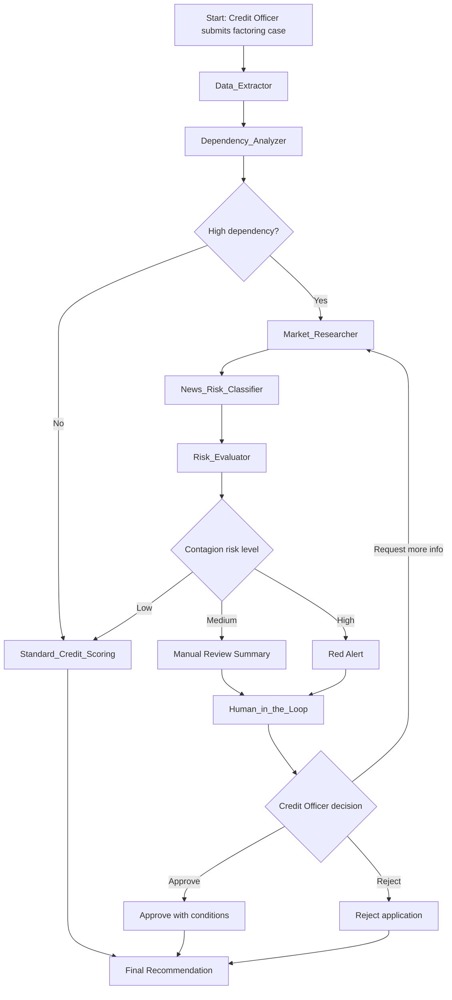

# PoC: B2B Supply Chain Risk Assessment Agent

## Tac nhan AI danh gia rui ro chuoi cung ung B2B cho SME

An autonomous AI agent for SME supply chain credit risk assessment, designed for invoice financing and factoring use cases.

---

## 1. Project Overview / Tong Quan Du An

### English

Traditional B2B credit approval processes often rely on static, historical financial statements. This creates a major blind spot: an SME may appear financially healthy while its largest buyer, supplier, or supply chain partner is facing a sudden liquidity crisis.

This Proof of Concept applies an agentic workflow architecture to build an autonomous AI agent that can:

- Analyze transaction relationships to identify critical supply chain dependencies.
- Trigger external search tools to retrieve real-time market news and sentiment about key counterparties.
- Evaluate contagion risk and generate a data-driven credit recommendation.
- Pause the workflow for human approval before any final credit decision is made.

### Tieng Viet

Trong quy trinh phe duyet tin dung B2B truyen thong, cac to chuc tai chinh thuong danh gia rui ro dua tren bao cao tai chinh lich su. Cach tiep can nay tao ra mot diem mu lon: mot SME co the trong co ve on dinh, nhung khach hang, nha cung cap, hoac doi tac chuoi cung ung lon nhat cua doanh nghiep do lai dang gap khung hoang thanh khoan.

PoC nay ap dung kien truc agentic workflow de xay dung mot tac nhan AI co kha nang:

- Phan tich quan he giao dich de xac dinh cac doi tac chuoi cung ung trong yeu.
- Tu dong kich hoat cong cu tim kiem de thu thap tin tuc thi truong theo thoi gian thuc ve cac doi tac nay.
- Danh gia rui ro lan truyen va dua ra khuyen nghi tin dung dua tren du lieu.
- Tam dung quy trinh de cho con nguoi phe duyet truoc khi co quyet dinh tin dung cuoi cung.

---

## 2. Business Problem / Bai Toan Nghiep Vu

### English

In invoice financing, the repayment source depends heavily on the buyer's ability to pay the invoice on time. If the buyer experiences a liquidity shock, supplier payment delays, legal disputes, or bond default risk, the borrower may face a chain-default event even if its own historical financials look acceptable.

The goal of this PoC is to help credit officers detect supply chain contagion risk before it appears in financial statements.

### Tieng Viet

Trong nghiep vu tai tro hoa don, nguon tra no phu thuoc rat lon vao kha nang thanh toan dung han cua ben mua hang. Neu ben mua gap cu soc thanh khoan, cham thanh toan nha cung cap, tranh chap phap ly, hoac rui ro vo no trai phieu, ben vay co the bi anh huong day chuyen ngay ca khi bao cao tai chinh lich su cua chinh ho van con tot.

Muc tieu cua PoC la ho tro can bo tin dung phat hien rui ro lan truyen trong chuoi cung ung truoc khi rui ro do xuat hien tren bao cao tai chinh.

---

## 3. Demo Scenario: The Contagion Use Case

### English

EcoCarton Packaging applies for invoice financing using a 2 billion VND receivable from GreenSupermarket. The invoice has a 90-day deferred payment term.

The internal transaction database shows that 85% of EcoCarton's historical cash flow depends on this buyer. The agent then searches for recent market news about the counterparty and discovers negative signals such as liquidity stress, supplier payment delays, or legal disputes.

Based on the internal dependency concentration and external market signals, the agent raises a Red Alert and recommends rejection or manual escalation.

> Note: EcoCarton is synthetic data. GreenSupermarket can be treated as a demo counterparty alias and may be mapped to a real-world company when running live market intelligence searches.

### Tieng Viet

EcoCarton Packaging nop ho so tai tro hoa don dua tren khoan phai thu tri gia 2 ty VND tu GreenSupermarket. Hoa don co ky han thanh toan tra cham 90 ngay.

Co so du lieu giao dich noi bo cho thay 85% dong tien lich su cua EcoCarton phu thuoc vao ben mua nay. Agent sau do tim kiem tin tuc thi truong moi nhat ve doi tac va phat hien cac tin hieu tieu cuc nhu cang thang thanh khoan, cham thanh toan nha cung cap, hoac tranh chap phap ly.

Ket hop muc do phu thuoc noi bo va tin hieu thi truong ben ngoai, agent phat canh bao do va khuyen nghi tu choi hoac chuyen ho so sang phe duyet thu cong.

> Ghi chu: EcoCarton la du lieu synthetic. GreenSupermarket co the duoc xem la alias doi tac trong demo va co the mapping voi mot cong ty that khi chay live market intelligence.

---

## 4. Scope And Data

### Internal Data: Synthetic

A local SQLite database simulates core banking and transaction data:

- Borrowers
- Counterparties
- Invoices
- Historical transaction logs
- Cash flow concentration metrics

### External Data: Real-Time

Search tools retrieve current market intelligence about identified counterparties:

- News articles
- Legal or dispute signals
- Bankruptcy or restructuring signals
- Bond default or liquidity stress signals
- Supplier payment delay signals

---

## 5. System Architecture

The system is orchestrated with LangGraph. The workflow is modeled as a state graph where each node performs a specific task and routing logic determines the next step.

### Core Components

| Component | Purpose |
|---|---|
| `AgentState` | Shared state object passed between LangGraph nodes |
| `Data_Extractor` | Retrieves borrower, invoice, and transaction data from SQLite |
| `Dependency_Analyzer` | Calculates counterparty concentration and dependency ratio |
| `Market_Researcher` | Searches real-time market news about critical counterparties |
| `Risk_Evaluator` | Synthesizes internal and external data into a risk level |
| `Credit_Recommender` | Produces a recommendation such as approve, reject, or escalate |
| `Human_in_the_Loop` | Pauses the workflow for Credit Officer approval |
| `SqliteSaver` | Persists workflow state by `thread_id` so interrupted flows can resume |

### Important Design Decision

Persistence must be implemented before Human-in-the-loop.

LangGraph interrupts require a checkpointer because the graph needs to save the current state, next node, and session context when the workflow pauses. Without SQLite persistence or another checkpointer, the workflow cannot reliably resume after human approval.

---

## 6. LangGraph Flowchart



---

## 7. Proposed Project Structure

```text
supply-chain-risk-agent/
  README.md
  .env
  .env.example
  requirements.txt

  data/
    core_banking.db
    checkpoints.sqlite
    seed_data.py

  src/
    main.py
    config.py
    state.py
    graph.py

    nodes/
      data_extractor.py
      dependency_analyzer.py
      market_researcher.py
      risk_evaluator.py
      credit_recommender.py
      human_review.py

    tools/
      database_tool.py
      search_tool.py

    prompts/
      market_research_prompt.py
      risk_evaluation_prompt.py

  outputs/
    sample_report_safe.md
    sample_report_high_risk.md
    sample_report_high_risk.json

  tests/
    test_data_extractor.py
    test_dependency_analyzer.py
    test_risk_evaluator.py
```

---

## 8. Expected Agent State

```python
from typing import TypedDict, List, Dict, Optional

class AgentState(TypedDict):
    application_id: str
    borrower_name: str
    invoice_amount_vnd: int
    counterparty_name: str

    transactions: List[Dict]
    dependency_ratio: float
    dependency_summary: str

    search_queries: List[str]
    market_news: List[Dict]
    market_sentiment: str

    contagion_risk_level: str
    risk_reasoning: str
    recommendation: str

    human_decision: Optional[str]
```

---

## 9. Development Roadmap

| Step | Action Item | Expected Result |
|---|---|---|
| 1 | Setup project and virtual environment | Clean Python project running successfully in VS Code |
| 2 | Create SQLite synthetic database | Database populated with borrowers, counterparties, invoices, and transactions |
| 3 | Develop `Data_Extractor` | System retrieves EcoCarton's transactions from SQLite |
| 4 | Develop `Dependency_Analyzer` | System calculates dependency metrics, such as 85% cash flow reliance |
| 5 | Integrate Tavily or DuckDuckGo search | Agent searches real-time news about the counterparty |
| 6 | Develop `Risk_Evaluator` | LLM evaluates data and returns `LOW`, `MEDIUM`, or `HIGH` risk |
| 7 | Implement SQLite persistence | Workflow state is saved and resumable by `thread_id` |
| 8 | Add Human-in-the-loop interrupt | Workflow pauses for Credit Officer approval or rejection |
| 9 | Execute two demo cases | One safe scenario and one high-risk scenario run successfully |
| 10 | Export JSON or Markdown report | Final structured report generated for PoC presentation |

---

## 10. Environment Setup

Create and activate a virtual environment:

```bash
python -m venv .venv
.venv\Scripts\activate
```

Install dependencies:

```bash
pip install -U langgraph langchain-openai langchain-community langchain-tavily langgraph-checkpoint-sqlite python-dotenv pandas duckduckgo-search beautifulsoup4 requests pydantic
```

Create `.env`:

```env
OPENAI_API_KEY=your_openai_api_key
TAVILY_API_KEY=your_tavily_api_key
```

---

## 11. Expected Demo Output

```text
Application ID: FACT-2026-001
Borrower: EcoCarton Packaging
Counterparty: GreenSupermarket
Invoice Amount: 2,000,000,000 VND
Payment Term: 90 days

Dependency Ratio: 85%
Market Signal: Negative liquidity news detected
Contagion Risk Level: HIGH
Agent Recommendation: REJECT or ESCALATE FOR MANUAL REVIEW
Human Decision: Pending approval
```

---

## 12. Business Value

### English

This PoC demonstrates a shift from static credit analysis to dynamic, event-driven risk monitoring. It helps financial institutions reduce underwriting time, identify real-time market risks before they appear on balance sheets, and maintain governance by keeping final decision authority in human hands.

### Tieng Viet

PoC nay the hien su chuyen dich tu phan tich tin dung tinh sang giam sat rui ro dong dua tren su kien. He thong giup to chuc tai chinh rut ngan thoi gian tham dinh, phat hien som rui ro thi truong truoc khi rui ro xuat hien tren bao cao tai chinh, va van dam bao quan tri bang cach giu quyen ra quyet dinh cuoi cung trong tay con nguoi.

---

## 13. Final Positioning

### English

An AI-assisted credit risk monitoring workflow for invoice financing, designed to detect supply chain contagion risk before it becomes visible in financial statements.

### Tieng Viet

Mot quy trinh giam sat rui ro tin dung co AI ho tro cho nghiep vu tai tro hoa don, duoc thiet ke de phat hien rui ro lan truyen trong chuoi cung ung truoc khi rui ro do xuat hien tren bao cao tai chinh.
